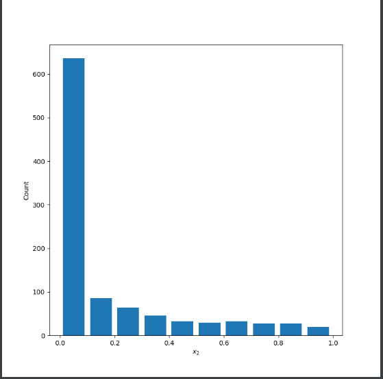
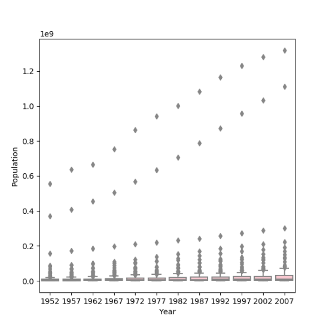

**Part 1:**

Continuous data is a type of numerical data type that can take any value within a range of numbers. For example, height and weight are each continuous data, as someone’s height or weight can be any value!
Ordinal data is a qualitative type of data, where the rank is what matters. One example of this is the results of a boat race, and a ranking of the different contenders based on time taken to complete.
Nominal data is data that does not have a specific value, but rather fits into a specific category. An example of this would be the continent a country belongs to, male or female, or eye color.

A model you could use is a competition on rowing machines where each contender rows 2 kilometers. Nominal data would be whether each contestant is male or female. Continuous data would be the time each person takes to row this length. Ordinal would be the rank of each person based on time.

**Part 2:**
 
Picture one: 

Mean: 0.5004439651051051

Median: 0.5080035994393222
 
Skewed left: 

Mean: 0.844825789919166

Median: 0.9687519963128917
 
Skewed right: 

 
Mean: 0.16748189662976135

Median: 0.02901661806972513
 
 
 
**Part 3:**

Raw data: 

 

After applying logarithmic transformation: 
 
 

 
The raw data plot best shows the change in life expectancy from 1952 to 2007. This is because it helps show the trend more clearly. A logarithmic transformation is useful when there are huge differences in the scales of data, but that is not the case here, and I think it is much harder for people to interpret the meaning of life expectency data when it is logarithmic.
 
**Part 4:**

Plot of populations: 

 

Logarithmic Transformation: 

 

The one that best communicates the change in population amongst all of these countries from 1952 to 2007 is the logarithmic transformation. This is because it makes the data much clearer. With the raw data, it is much harder to see the quartiles, and everything but the largest outliers are incredibly hard to distinguish between. This is because there are such big ranges in the data, and only the outliers are really clear because they are so big. With the logarithmic transformation, the data is more spread out.
